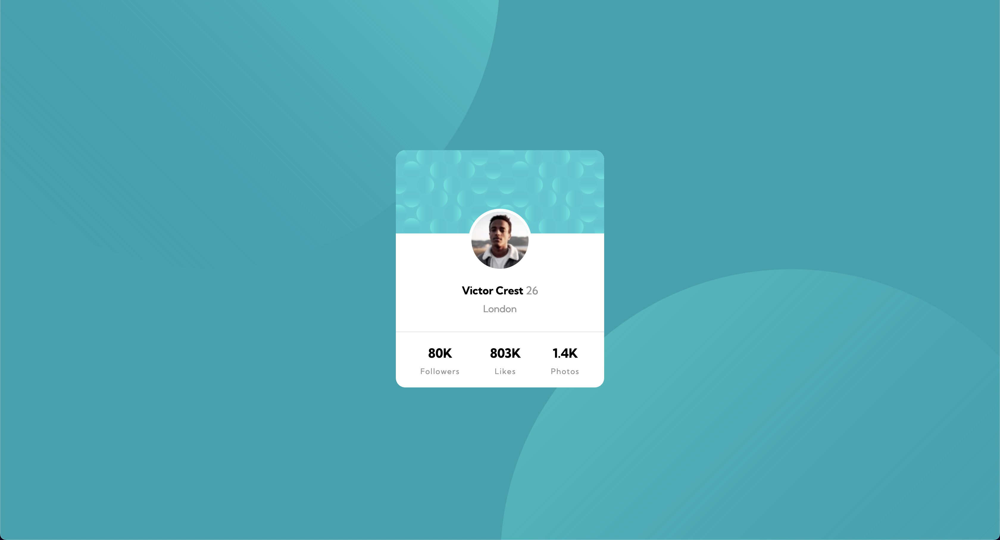

### Links

- Solution URL: [https://www.frontendmentor.io/solutions/profile-card-component-solution-UzrK4o2ty2](https://www.frontendmentor.io/solutions/profile-card-component-solution-UzrK4o2ty2)
- Live Site URL: [https://user9511.github.io/frontend-mentor-profile-card-component/](https://user9511.github.io/frontend-mentor-profile-card-component/)

# Frontend Mentor - Profile card component solution

This is a solution to the [Profile card component challenge on Frontend Mentor](https://www.frontendmentor.io/solutions/profile-card-component-solution-UzrK4o2ty2). Frontend Mentor challenges help you improve your coding skills by building realistic projects.

## Table of contents

- [Links](#links)
- [Screenshot](#screenshot)
- [Built with](#built-with)
- [Author](#author)

### The challenge

- Build out the project to the designs provided

### Screenshot

### Built with

- Semantic HTML5 markup
- CSS custom properties
- Flexbox
- CSS Grid

## Author

- Frontend Mentor - [@Smgy94](https://www.frontendmentor.io/profile/Smgy94)
- Twitter - [@@ShaneMcGeown94](https://twitter.com/ShaneMcGeown94)
